# 戦闘システム実装計画書

## 概要

TaskManagerと連携した戦闘システムの実装計画。TimeManagerComponentのターンベース処理に統合し、チームタスクとして「冒険」が設定された際に戦闘を実行する。

## 設計方針

### 1. 基本原則

- **ターンベース再計算**: 毎ターン現在の状況から最適な行動を再計算
- **中断不可能性**: 戦闘開始後は終了まで他のタスクに切り替え不可
- **TimeManager統合**: 独立タイマーは使用せず、TimeManagerからの呼び出しで処理
- **簡潔な状態管理**: 複雑な状態機械を避け、現在の状況のみで判断

### 2. 責任分担原則

- **単一責任の原則**: 各コンポーネントは1つの明確な役割のみ
- **依存関係の方向性**: 上位コンポーネント → 下位コンポーネントの一方向のみ
- **制御の逆転**: データプロバイダーは制御しない（呼ばれるのみ）
- **カプセル化**: 詳細実装は外部に公開しない

### 3. 実際のレイヤー構造（委譲型設計）

```
┌─────────────────┐
│   TimeManager   │ ← フロー制御層（高レベル調整）
│                 │   ↓ データ取得・処理委譲
├─────────────────┤
│  TaskManager    │ ← データ層（タスク情報提供）
│  TeamComponent  │ ← 状態管理層（チーム状態）
│ CombatComponent │ ← 処理層（戦闘実行）
├─────────────────┤
│ActionSystemComp │ ← 実行エンジン層（行動処理）
├─────────────────┤
│LocationEventMgr │ ← データサービス層（敵データ）
└─────────────────┘
```

**設計原則**:
- **TimeManager**: 詳細を知らず、データ取得 + 処理委譲のみ
- **各専門コンポーネント**: 自分の責任のみ担当
- **依存関係**: 上位→下位の一方向のみ
- **委譲パターン**: 実装詳細は下位レイヤーが担当

### 2. 戦闘システムの特殊性

採集システムとの最大の違いは「中断不可能性」:
- **採集**: タスク優先度が変われば すぐに中断して別タスクへ
- **戦闘**: 開始したら終了まで継続（どちらかが全滅するまで）

## 実装ステップ

### Phase 1: データ準備（必須）

1. **CharacterPresets.csv拡張**
   - wolf、bear、rock_golem、trollなど不足している敵データを追加
   - 各敵の基本ステータス、スキル、自然武器を定義

2. **戦闘タスクの定義**
   - TaskDataTable.csvに「冒険」タスクタイプを追加
   - タスクのTargetLocationを戦闘発生地点として使用

### Phase 2: TaskManager統合

1. **TaskManagerComponent改修**
   ```cpp
   // 戦闘中フラグの追加
   UPROPERTY()
   TMap<ATeamActor*, bool> TeamInCombatMap;
   
   // タスク決定時の戦闘チェック
   if (TeamInCombatMap.Contains(Team) && TeamInCombatMap[Team])
   {
       // 戦闘中は現在のタスクを維持
       return CurrentTask;
   }
   ```

2. **戦闘開始条件**
   - チームが目標地点に到着
   - タスクタイプが「冒険」
   - 戦闘中でない

### Phase 3: CombatComponent改修

1. **TimeManager統合**
   ```cpp
   UFUNCTION()
   void ProcessCombat(ATeamActor* Team, float DeltaTime);
   ```
   - 独立タイマーを削除
   - TimeManagerから毎ターン呼び出される処理を実装

2. **戦闘フロー簡略化**
   ```
   ターン1: 移動中 → 目的地へ向かう
   ターン2: 到着 → 敵とエンカウント、戦闘開始
   ターン3～N: 戦闘中 → 各キャラクターが行動
   ターンN+1: 戦闘終了 → 帰還開始
   ```

3. **戦闘処理の実装**
   - LocationEventManagerから敵情報を取得
   - ActionSystemComponentで行動解決
   - 勝敗判定と報酬処理

### Phase 4: 移動と戦闘の統合

1. **TeamComponent改修**
   - 移動完了後に戦闘開始をトリガー
   - 戦闘終了後の自動帰還

2. **LocationEventManager連携**
   - 到着時の敵スポーン処理
   - EnemySpawnListStringからランダムに敵を選択

### Phase 5: UI統合（オプション）

1. **戦闘状態の表示**
   - TeamUIに戦闘中インジケーター追加
   - 戦闘ログの表示

2. **戦闘進行の可視化**
   - HPバー、行動順、スキル使用状況

## コンポーネント責任分担

### 各コンポーネントの役割

#### **TeamComponent** - チーム総合管理（最上位）
- チーム状態の総合管理
- 冒険タスク実行制御
- 戦闘開始判断とトリガー
- 戦闘前後の状態管理
- TimeManagerとの直接連携

#### **CombatComponent** - 戦闘マネージャー（戦略レベル）
- 戦闘全体の状態管理 (`ECombatState`)
- 戦闘セッション制御
- 敵チーム取得と管理
- ActionSystemとの連携
- 勝敗判定と結果処理

#### **ActionSystemComponent** - 行動エンジン（戦術レベル）
- 個別キャラクターの行動管理
- 行動ゲージシステム
- 行動順序決定
- 実際の攻撃処理・ダメージ計算
- ターン毎の行動実行

#### **LocationEventManager** - データプロバイダー（サービス層）
- 場所固有の敵データ提供
- 敵キャラクター生成サービス
- 場所データの管理
- **戦闘制御はしない**（データ提供のみ）

#### **TimeManager** - フロー制御（統合層）
- ターンベース処理制御
- **TaskManagerからデータ受け取り**（タスク詳細は知らない）
- **処理を下位コンポーネントに委譲**（実装詳細は知らない）
- 高レベルフローの調整のみ

#### **TaskManager** - データプロバイダー（データ層）
- タスクデータの管理と提供
- タスク優先度計算
- **実行方法は関与しない**（データ提供のみ）

## 冒険タスク → 戦闘完了 詳細フロー

### Phase 1: 目的地到着 → 戦闘開始

#### **現在のフロー（問題あり）**


#### **実際のフロー（正しい実装）**


### Phase 2: 戦闘ループ（毎ターン処理）


### Phase 3: 戦闘終了処理

```mermaid
sequenceDiagram
    participant CC as CombatComponent
    participant TC as TeamComponent
    participant ASC as ActionSystemComponent
    participant EM as EventManager

    CC->>ASC: StopActionSystem()
    Note over ASC: 行動システム停止
    
    CC->>ASC: ClearAllCharacters()
    Note over ASC: キャラクター登録解除
    
    CC->>TC: SetTeamCombatState(NotInCombat)
    Note over TC: 戦闘フラグクリア
    
    CC->>TC: SetTeamActionState(Idle)
    Note over TC: アクション状態リセット
    
    CC->>EM: LogCombatEnd(Winners, Losers, Duration)
    Note over EM: 戦闘ログ記録
    
    CC->>CC: CleanupAfterCombat()
    Note over CC: 戦闘データクリーンアップ
    
    CC->>CC: SetCombatState(Inactive)
    Note over CC: 戦闘状態リセット
```



## 行動ゲージシステム詳細設計

### ゲージ保持場所

**場所**: `ActionSystemComponent`内の`FCharacterAction`構造体

**理由**:
- 戦闘中のみ必要なデータ
- 行動制御ロジックと一体化
- 戦闘終了時の自動クリーンアップ
- キャラクター本体に戦闘専用データを持たせない設計

### ゲージシステム実装

```cpp
struct FCharacterAction
{
    // 行動ゲージ（0-100）
    float ActionGauge;
    
    // ゲージ増加速度（毎ターン増加量）
    float GaugeSpeed;
    
    // 速度倍率（バフ/デバフ用）
    float SpeedMultiplier;
    
    // 行動優先度（同ゲージ値時の順序決定用）
    int32 ActionPriority;
    
    // ターン毎のゲージ更新
    void UpdateGauge()
    {
        ActionGauge += GaugeSpeed * SpeedMultiplier;
        ActionGauge = FMath::Clamp(ActionGauge, 0.0f, 200.0f);
    }
    
    // 行動可能かチェック
    bool CanAct() const
    {
        return ActionGauge >= 100.0f;
    }
    
    // 行動後のゲージリセット
    void ResetAfterAction()
    {
        ActionGauge = 0.0f;
    }
    
    // 行動優先度計算（ゲージ値 + 優先度）
    float GetActionScore() const
    {
        return ActionGauge + (ActionPriority * 0.01f);
    }
};
```

### ゲージ初期化ロジック

```cpp
// ActionSystemComponent::RegisterCharacter内
void InitializeCharacterGauge(FCharacterAction& Action, AC_IdleCharacter* Character)
{
    // キャラクターのAGI値からゲージ速度を計算
    if (UCharacterStatusComponent* Status = Character->GetStatusComponent())
    {
        float AGI = Status->GetAgility();
        Action.GaugeSpeed = AGI * 0.5f; // AGI値の半分をベース速度に
        Action.ActionPriority = AGI;    // AGI値を優先度に設定
    }
    
    Action.ActionGauge = 0.0f;
    Action.SpeedMultiplier = 1.0f;
}
```

### バフ/デバフ対応

```cpp
// バフ例: ヘイスト効果
void ApplyHasteBuff(FCharacterAction& Action)
{
    Action.SpeedMultiplier = 2.0f; // 速度2倍
}

// デバフ例: スロウ効果
void ApplySlowDebuff(FCharacterAction& Action)
{
    Action.SpeedMultiplier = 0.5f; // 速度半減
}

// 先制攻撃スキル
void ApplyFirstStrike(FCharacterAction& Action)
{
    Action.ActionPriority += 1000; // 大幅優先度アップ
}
```

## 技術的実装詳細

### 戦闘中断不可能性の実装

```cpp
// TaskManagerComponent内
void UTaskManagerComponent::DetermineTeamTask(ATeamActor* Team)
{
    // 戦闘中チェック
    if (UCombatComponent* Combat = Team->GetCombatComponent())
    {
        if (Combat->IsInCombat())
        {
            // 戦闘中は現在のタスクを維持
            return;
        }
    }
    
    // 通常のタスク優先度計算
    // ...
}
```

### 1ターン1行動戦闘処理

```cpp
// CombatComponent内
void UCombatComponent::ProcessCombat(float DeltaTime)
{
    switch (CurrentState)
    {
        case ECombatState::InProgress:
            // 1ターン1行動システム
            if (ActionSystemComponent)
            {
                bool bActionProcessed = ActionSystemComponent->ProcessSingleTurnWithGauge();
                if (bActionProcessed)
                {
                    CheckCombatCompletion();
                }
            }
            break;
    }
}
```

### ゲージベース行動順序決定

```cpp
// ActionSystemComponent内
AC_IdleCharacter* UActionSystemComponent::GetNextActingCharacterWithGauge() const
{
    AC_IdleCharacter* NextCharacter = nullptr;
    float HighestScore = 0.0f;
    
    // 全キャラクターから最高スコアを持つキャラクターを選択
    for (const FCharacterAction& Action : AllCharacterActions)
    {
        if (Action.CanAct() && Action.GetActionScore() > HighestScore)
        {
            HighestScore = Action.GetActionScore();
            NextCharacter = Action.Character;
        }
    }
    
    return NextCharacter;
}
```

## テスト計画

### 単体テスト

1. 戦闘中のタスク切り替え拒否
2. 戦闘終了後の正常なタスク再開
3. 敵スポーンの確率分布

### 統合テスト

1. 移動→戦闘→帰還の一連フロー
2. 複数チームの同時戦闘
3. 戦闘中のTimeManager停止/再開

## リスクと対策

### リスク1: デッドロック

- **問題**: 戦闘が終了しない状態に陥る
- **対策**: 最大ターン数の設定、強制終了条件の実装

### リスク2: パフォーマンス

- **問題**: 多数の戦闘同時実行時の処理負荷
- **対策**: 戦闘演算の最適化、非同期処理の検討

### リスク3: バランス調整

- **問題**: 戦闘の難易度バランス
- **対策**: 敵ステータスの段階的調整、テストプレイによる検証

## 実装優先順位

1. **必須**: CharacterPresets.csv拡張、基本的な戦闘フロー
2. **重要**: TaskManager統合、中断不可能性の実装
3. **推奨**: UI表示、詳細な戦闘ログ
4. **オプション**: 戦闘アニメーション、エフェクト

## 参考実装

- 採集システム（docs/specifications/tasks/採集仕様書.md）のTimeManager統合パターン
- 既存のCombatComponent、ActionSystemComponentの活用
- LocationEventManagerの敵スポーン機能の利用