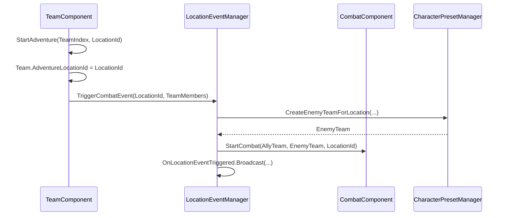
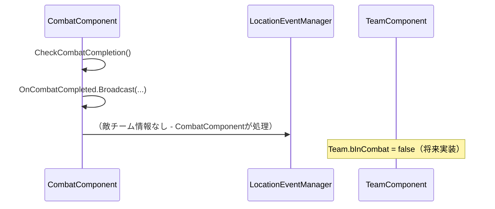

# LocationEventManager 仕様書

## 概要

`ULocationEventManager`は、ゲーム内の場所でのイベント（戦闘、採取など）をトリガーするActorComponentです。チームが場所に派遣された際の敵生成とイベント発火を担当し、戦闘システムとの橋渡しを行います。

## アーキテクチャの変更点

### 旧システム（LocationManagerComponent）
```
TeamComponent → CombatComponent → LocationManagerComponent
                                  ├── 場所管理
                                  ├── チーム場所管理 ❌
                                  └── 敵生成
```

### 新システム（LocationEventManager）
```
TeamComponent ─┬── チーム場所管理 ✅
               └── LocationEventManager → CombatComponent
                   ├── イベントトリガー専用
                   └── 敵生成委託
```

## 責任の分離

### TeamComponent
- チームの現在地管理（`Team.AdventureLocationId`）
- 冒険開始処理
- LocationEventManagerへのイベント委託

### LocationEventManager
- 場所でのイベントトリガー（戦闘、採取）
- 敵チーム生成
- CombatComponentへの戦闘委託

### CombatComponent
- 戦闘処理専用
- 場所情報の管理なし

## 主要機能の呼び出し関数

### イベントトリガー

```cpp
// 戦闘イベント開始
bool Success = LocationEventManager->TriggerCombatEvent("plains", AllyTeam);

// 採取イベント開始（将来実装）
bool Success = LocationEventManager->TriggerGatheringEvent("swamp", AllyTeam);

// 敵チーム生成
TArray<AC_IdleCharacter*> EnemyTeam = LocationEventManager->CreateEnemyTeamForLocation(
    WorldContext, "cave", SpawnLocation, 2);
```

### 情報取得

```cpp
// 場所データ取得
FLocationDataRow LocationData = LocationEventManager->GetLocationData("plains");

// 場所表示名取得
FString LocationName = LocationEventManager->GetLocationDisplayName("plains");

// 戦闘可能かチェック
bool CanFight = LocationEventManager->CanTriggerCombatAtLocation("plains");
```

### イベントバインディング

```cpp
// イベント発火通知
LocationEventManager->OnLocationEventTriggered.AddDynamic(
    this, &AMyActor::OnLocationEventHandler);

// 敵チーム生成通知
LocationEventManager->OnEnemyTeamCreated.AddDynamic(
    this, &AMyActor::OnEnemyTeamCreatedHandler);
```

## イベントフロー

### 冒険開始からイベントトリガーまで



### 戦闘終了処理



## 敵生成システム

### CreateEnemyTeamForLocation

```cpp
TArray<AC_IdleCharacter*> ULocationEventManager::CreateEnemyTeamForLocation(
    UObject* WorldContextObject,
    const FString& LocationId,
    const FVector& SpawnLocation,
    int32 EnemyCount)
{
    // 1. 場所から確率ベースで敵選択
    // 2. CharacterPresetManagerに生成委託
    // 3. スポーン位置計算（円形配置）
    // 4. 敵チーム登録
    // 5. イベント通知
}
```

### 敵スポーン位置計算

```cpp
FVector CalculateEnemySpawnPosition(const FVector& CenterLocation, float Radius, int32 Index)
{
    // 敵を円形に配置
    float Angle = (360.0f / MaxEnemiesPerTeam) * Index * (PI / 180.0f);
    float Distance = FMath::RandRange(Radius * 0.5f, Radius);
    
    FVector Offset(
        Distance * FMath::Cos(Angle),
        Distance * FMath::Sin(Angle),
        0.0f
    );
    
    return CenterLocation + Offset;
}
```

## イベントシステム

### OnLocationEventTriggered

```cpp
DECLARE_DYNAMIC_MULTICAST_DELEGATE_ThreeParams(FOnLocationEventTriggered, 
    const FString&, LocationId, 
    const FString&, EventType, 
    const TArray<AC_IdleCharacter*>&, ParticipatingTeam);
```

**発火タイミング**: イベントトリガー時
**用途**: UI更新、ログ記録、統計情報

### OnEnemyTeamCreated

```cpp
DECLARE_DYNAMIC_MULTICAST_DELEGATE_TwoParams(FOnEnemyTeamCreated, 
    const TArray<AC_IdleCharacter*>&, EnemyTeam, 
    const FString&, LocationId);
```

**発火タイミング**: 敵チーム生成成功時
**用途**: 戦闘準備、AI設定、UI通知

## 設定可能パラメータ

### Blueprint設定項目

```cpp
// 最大敵数（チームあたり）
UPROPERTY(EditAnywhere, BlueprintReadWrite, Category = "Settings")
int32 MaxEnemiesPerTeam = 3;

// 敵スポーン半径
UPROPERTY(EditAnywhere, BlueprintReadWrite, Category = "Settings")
float EnemySpawnRadius = 500.0f;
```

## 敵チーム管理

### 生成・登録・削除

```cpp
// 敵チーム登録（戦闘開始時）
void RegisterEnemyTeam(const TArray<AC_IdleCharacter*>& EnemyTeam, const FString& LocationId);

// 敵チーム削除（戦闘終了時）
void UnregisterEnemyTeam(const TArray<AC_IdleCharacter*>& EnemyTeam);

// 全敵チームクリア
void ClearAllEnemyTeams();
```

### メモリ管理

- **登録**: `ActiveEnemyTeams`マップで場所ごとに管理
- **削除**: `Enemy->Destroy()`でアクター削除
- **クリア**: 全敵を即座に削除してメモリリーク防止

## デバッグ・ログ機能

### ログ出力例

```
LocationEventManager: Combat event triggered at location plains with 3 allies vs 1 enemies
LocationEventManager: Created enemy rat for location plains
LocationEventManager: Registered enemy team (1 enemies) for location plains
LocationEventManager: Cleared all enemy teams
```

### デバッグ用関数

```cpp
// Blueprint/C++でデバッグ情報取得
void PrintDebugInfo()
{
    for (auto& Pair : ActiveEnemyTeams)
    {
        UE_LOG(LogTemp, Log, TEXT("Location: %s, Enemies: %d"), 
            *Pair.Key, Pair.Value.Num());
    }
}
```

## 使用例

### シナリオ1: チーム冒険開始

```cpp
// TeamComponent.cpp
bool UTeamComponent::StartAdventure(int32 TeamIndex, const FString& LocationId)
{
    FTeam& Team = Teams[TeamIndex];
    Team.AdventureLocationId = LocationId;
    Team.bInCombat = true;

    // LocationEventManagerに委託
    ULocationEventManager* EventManager = GetOwner()->FindComponentByClass<ULocationEventManager>();
    return EventManager->TriggerCombatEvent(LocationId, Team.Members);
}
```

### シナリオ2: カスタムイベント実装

```cpp
// 将来の採取イベント例
bool ULocationEventManager::TriggerGatheringEvent(const FString& LocationId, const TArray<AC_IdleCharacter*>& AllyTeam)
{
    // 採取可能な場所かチェック
    FLocationDataRow LocationData = GetLocationData(LocationId);
    if (LocationData.LocationType != ELocationType::Forest)
    {
        return false;
    }

    // 採取処理（実装予定）
    // ...

    OnLocationEventTriggered.Broadcast(LocationId, TEXT("Gathering"), AllyTeam);
    return true;
}
```

## TeamComponentとの連携

### 場所管理の責任分離

```cpp
// TeamComponent - チーム情報管理
FTeam& Team = Teams[TeamIndex];
Team.AdventureLocationId = LocationId;  // チームの現在地
Team.bInCombat = true;                   // 戦闘状態

// LocationEventManager - イベント処理のみ
LocationEventManager->TriggerCombatEvent(LocationId, Team.Members);
```

### データの流れ

1. **TeamComponent**: チームの場所を`Team.AdventureLocationId`で管理
2. **LocationEventManager**: 場所でのイベントをトリガー
3. **CombatComponent**: イベントから受け取った敵チームで戦闘処理

## 今後の拡張予定

### 計画中の機能

1. **採取イベント**: `TriggerGatheringEvent`の完全実装
2. **ランダムイベント**: 場所固有の特殊イベント
3. **イベント条件**: 時間帯、天候による発生条件
4. **マルチイベント**: 同時複数イベントの管理
5. **イベント履歴**: 発生したイベントの記録・統計

### API拡張予定

```cpp
// 将来の拡張API
bool TriggerRandomEvents(const FString& LocationId);
void SetEventConditions(const FString& LocationId, const FEventConditions& Conditions);
TArray<FEventHistory> GetLocationEventHistory(const FString& LocationId);
bool CanTriggerMultipleEvents(const FString& LocationId);
```

## パフォーマンス考慮事項

### 最適化ポイント

1. **敵生成制限**: `MaxEnemiesPerTeam`で大量生成を防止
2. **即座削除**: 戦闘終了時の敵アクター即座削除
3. **イベント分離**: 各イベントタイプの独立処理
4. **軽量通知**: イベントディスパッチャーでの効率的な通知

### メモリ管理

- **敵チーム**: 戦闘終了時に自動削除
- **イベント履歴**: 必要に応じて古い履歴を削除
- **参照管理**: WeakPtrの活用でメモリリーク防止