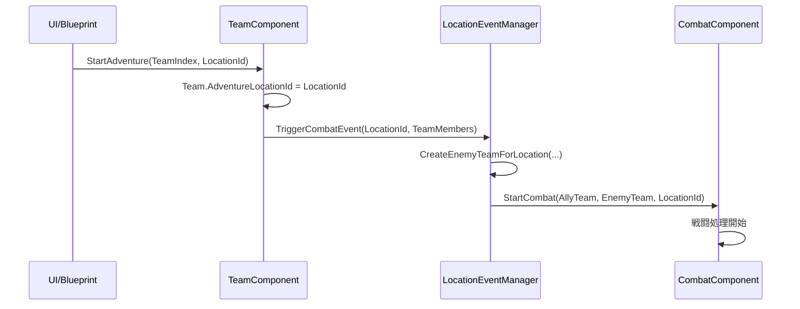

# LocationManagerComponent 仕様書 [重要: アーキテクチャ変更]

## ⚠️ 重要なアーキテクチャ変更

**LocationManagerComponent は LocationEventManager に置き換えられました。**

新しいアーキテクチャについては [`LocationEventManager.md`](./LocationEventManager.md) を参照してください。

## 変更理由

### 旧システムの問題点

LocationManagerComponent が以下の責任を混在して持っていました：
- ❌ チーム場所の管理（TeamComponentの責任）
- ❌ 戦闘開始処理（CombatComponentの責任）  
- ✅ 場所データ管理
- ✅ 敵生成処理

### 新システムの責任分離

| コンポーネント | 責任 |
|---------------|------|
| **TeamComponent** | チーム場所管理（`Team.AdventureLocationId`） |
| **LocationEventManager** | 場所でのイベントトリガー、敵生成委託 |
| **CombatComponent** | 戦闘処理専用 |

## 移行ガイド

### 旧コード（使用禁止）

```cpp
// ❌ 旧システム - 使用しないでください
LocationManagerComponent->SetCurrentLocation("plains");
LocationManagerComponent->SpawnEnemyAtLocation(WorldContext, Location);
CombatComponent->SetLocationManager(LocationManagerComponent);
```

### 新コード（推奨）

```cpp
// ✅ 新システム - こちらを使用してください

// チーム場所管理
TeamComponent->StartAdventure(TeamIndex, "plains");

// イベントトリガー
LocationEventManager->TriggerCombatEvent("plains", AllyTeam);

// 敵生成
TArray<AC_IdleCharacter*> Enemies = LocationEventManager->CreateEnemyTeamForLocation(
    WorldContext, "plains", SpawnLocation, 2);
```

## 新しいデータフロー

### 冒険開始処理



## 削除された機能

以下の機能は LocationEventManager に移行または廃止されました：

### 削除された関数

```cpp
// 削除された関数（LocationEventManagerに移行）
void SetCurrentLocation(const FString& LocationId);           // → TeamComponent管理
AC_IdleCharacter* SpawnEnemyAtLocation(...);                 // → CreateEnemyTeamForLocation
TArray<AC_IdleCharacter*> SpawnMultipleEnemies(...);         // → CreateEnemyTeamForLocation
FString GetCurrentLocationId();                              // → Team.AdventureLocationId
void ClearAllEnemies();                                      // → ClearAllEnemyTeams

// 削除されたイベント
FOnLocationChanged OnLocationChanged;                        // → 不要（TeamComponent管理）
```

## 移行チェックリスト

### Blueprint更新

- [ ] LocationManagerComponent への参照を削除
- [ ] LocationEventManager の参照を追加
- [ ] 冒険開始処理を TeamComponent.StartAdventure に変更
- [ ] イベントバインディングを LocationEventManager に変更

### C++コード更新

```cpp
// 1. Include文変更
// ❌ #include "LocationManagerComponent.h"
// ✅ #include "LocationEventManager.h"

// 2. メンバー変数変更
// ❌ UPROPERTY() ULocationManagerComponent* LocationManager;
// ✅ UPROPERTY() ULocationEventManager* EventManager;

// 3. 関数呼び出し変更
// ❌ LocationManager->SetCurrentLocation("plains");
// ✅ TeamComponent->StartAdventure(TeamIndex, "plains");
```

## 場所データシステム（継続）

以下の場所データシステムは継続して使用されます：

### LocationData.csv形式

```csv
RowName,Name,Description,LocationType,EnemySpawnListString
"base","拠点","安全な活動拠点","Base",""
"plains","平野","開けた草原地帯","Plains","rat:0.8|giant_frog:0.2"
"swamp","沼地","湿地帯","Swamp","giant_frog:0.7|rat:0.3"
"cave","洞窟","薄暗い地下空間","Cave","goblin:0.6|rat:0.4"
```

### EnemySpawnListString形式

**構文**: `"敵ID:確率|敵ID:確率|..."`
**例**: `"rat:0.8|giant_frog:0.2"` (ネズミ80%、巨大ガエル20%)

## 場所タイプ（継続）

### ELocationType

| 値 | 表示名 | 説明 |
|---|-------|------|
| Base | 拠点 | 安全地帯（敵出現なし） |
| Plains | 平野 | 草原地帯 |
| Swamp | 沼地 | 湿地帯 |
| Cave | 洞窟 | 地下空間 |

## 詳細な新システム情報

新しいLocationEventManagerシステムの詳細については、以下のドキュメントを参照してください：

- **LocationEventManager.md** - 新システムの完全な仕様
- **TeamComponent仕様** - チーム場所管理の詳細
- **CombatComponent仕様** - 戦闘システムとの連携

## よくある質問

### Q: LocationManagerComponent は完全に削除されたのですか？

A: はい。責任分離のため以下に分割されました：
- **チーム場所管理** → TeamComponent
- **イベントトリガー** → LocationEventManager
- **戦闘処理** → CombatComponent

### Q: 既存のBlueprint はどうすれば良いですか？

A: LocationManagerComponent への参照をすべて削除し、新しいコンポーネントの適切な関数を使用してください。詳細は移行ガイドを参照。

### Q: 場所データ（CSV）は変更されましたか？

A: いいえ。LocationData.csv と CharacterPresets.csv はそのまま使用できます。

## サポート終了

LocationManagerComponent は今後サポートされません。新しい機能開発は LocationEventManager を使用してください。