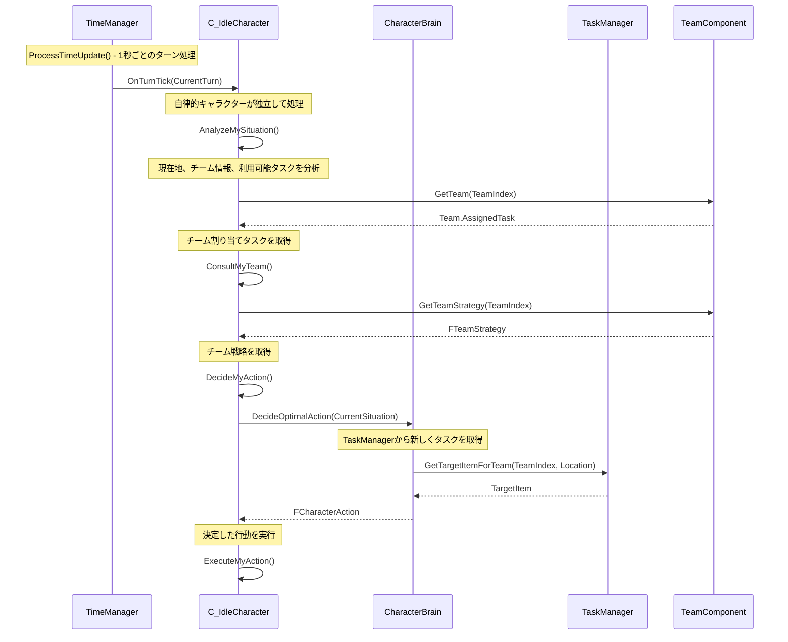
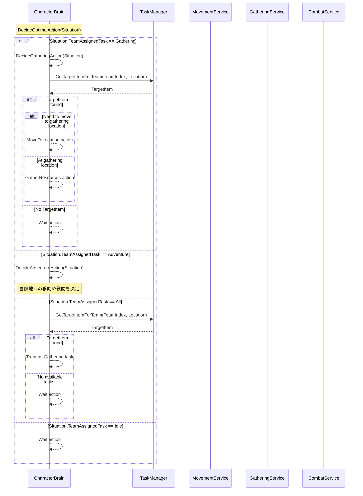
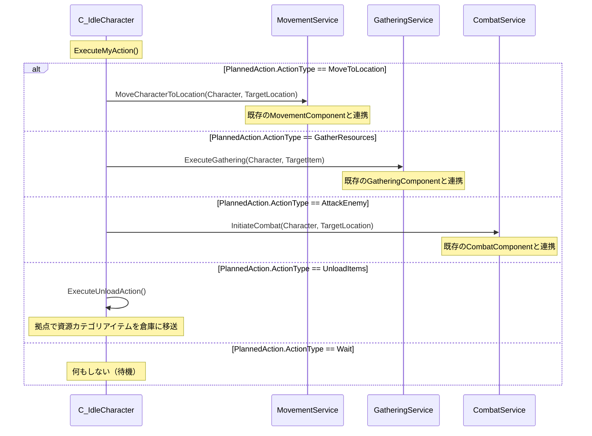
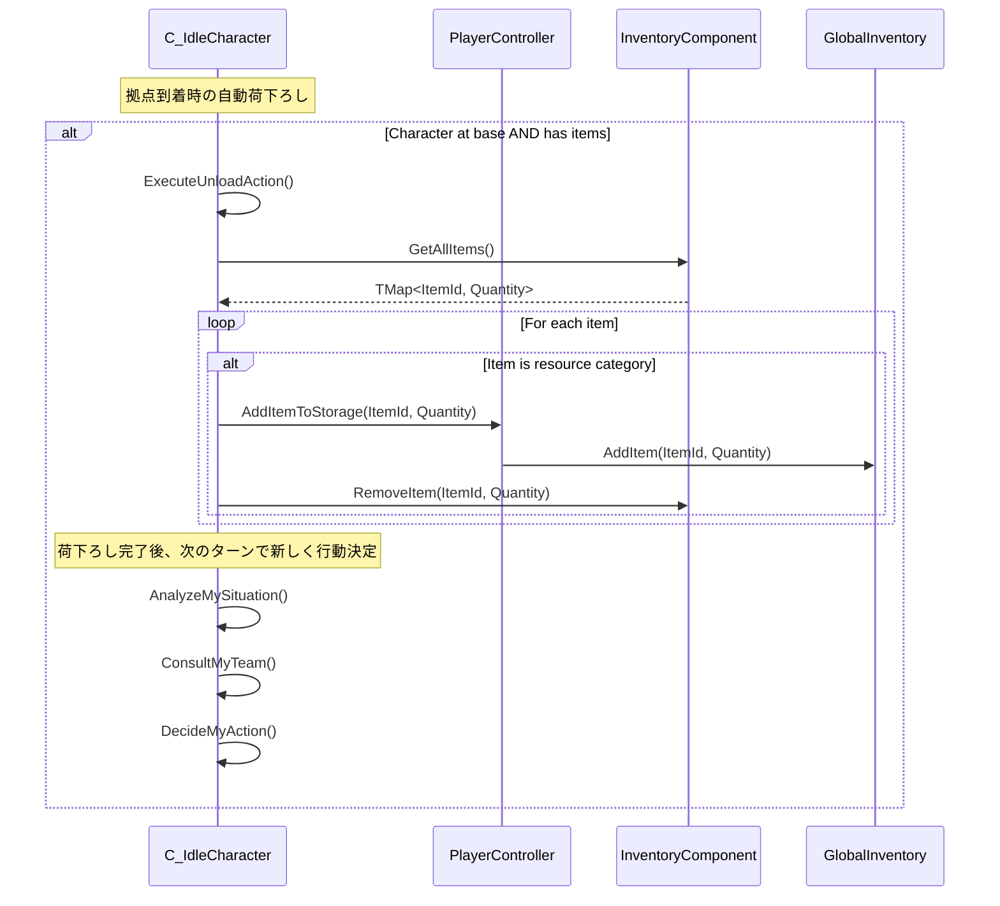
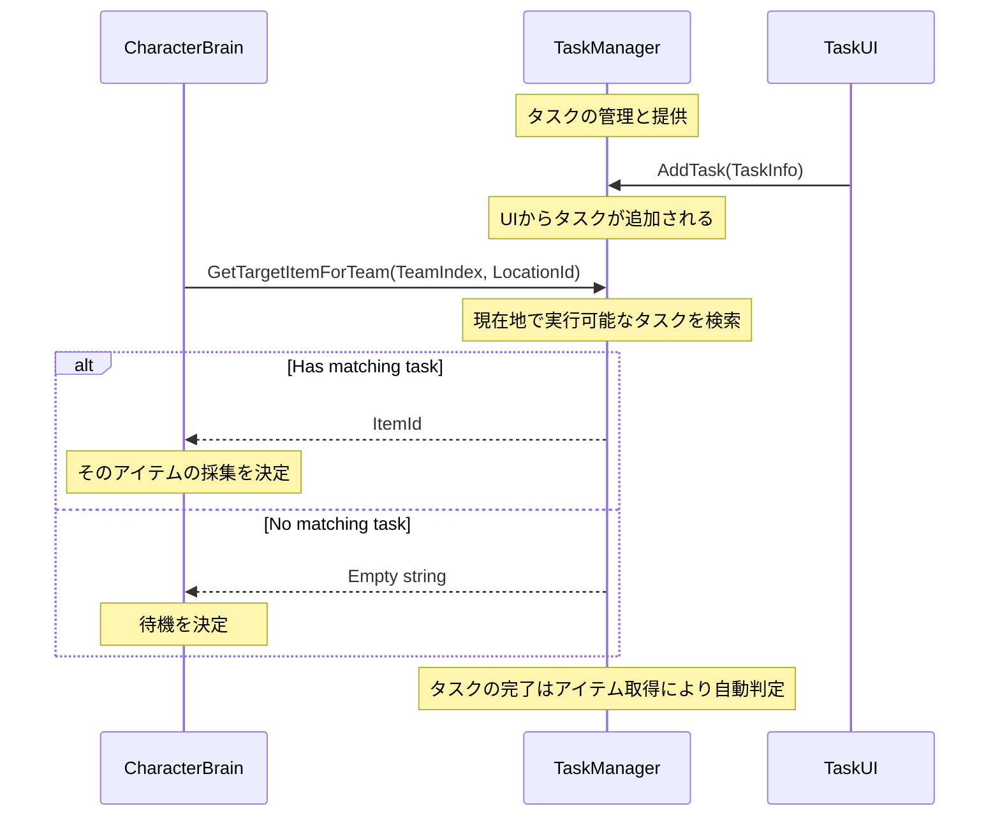
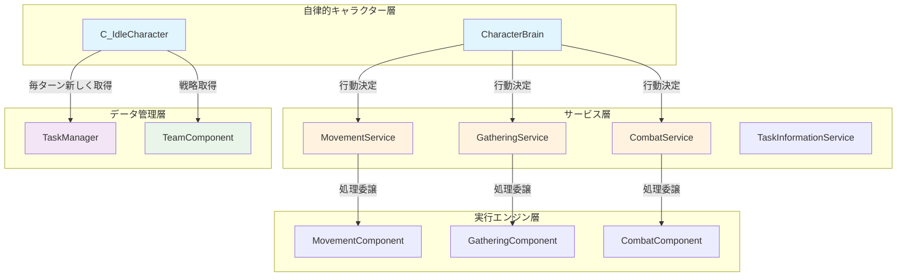

# タスクフロー図

## 概要

自律的キャラクターシステムを中心とした「ボトムアップ設計」のフロー図です。各キャラクターが独立して行動決定を行い、TaskManagerから毎ターン新しくタスクを取得します。

## 1. 基本ターン処理フロー（実装ベース）



## 2. CharacterBrainの行動決定フロー



## 3. 行動実行フロー



## 4. 荷下ろしフロー（採集とは独立）



## 5. TaskManagerとの連携



## 6. 状態管理の境界



## 7. 重要な設計原則

### ✅ 現在の正しい設計

1. **毎ターン新規判断**: キャラクターは毎ターンTaskManagerから新しくタスクを取得
2. **状態非依存**: 前のターンの状態は基本的に関係ない（戦闘以外）
3. **荷下ろし独立**: 荷下ろしは採集とは無関係な独立した処理
4. **ボトムアップ**: 各キャラクターが独立して行動決定

### ❌ 避けるべきアンチパターン

1. **状態依存**: 前のターンの採集状態に基づく判断
2. **複雑な状態遷移**: GatheringComponentが複雑な状態を保持
3. **採集と荷下ろしの結合**: 荷下ろし完了を採集システムに通知
4. **トップダウン制御**: 上位コンポーネントが詳細を制御

### 🔄 正しいフロー例

```
ターンN: TaskManager「木材を5個採集」→ キャラクター「平原に移動」
ターンN+1: TaskManager「木材を5個採集」→ キャラクター「平原で採集」
ターンN+2: TaskManager「木材完了、タスクなし」→ キャラクター「拠点に帰還」
ターンN+3: TaskManager「新しいタスクなし」→ キャラクター「待機」
```

### 💾 状態の責任分担

- **TaskManager**: どのタスクが利用可能かを管理
- **CharacterBrain**: 毎ターンTaskManagerから取得して行動決定
- **GatheringComponent**: 採集アクション実行時のみ状態管理
- **荷下ろし**: 拠点到着時の自動処理（状態無関係）