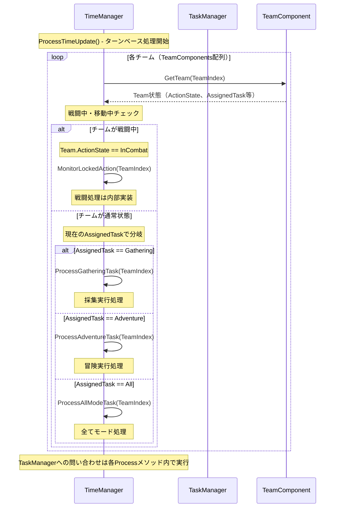
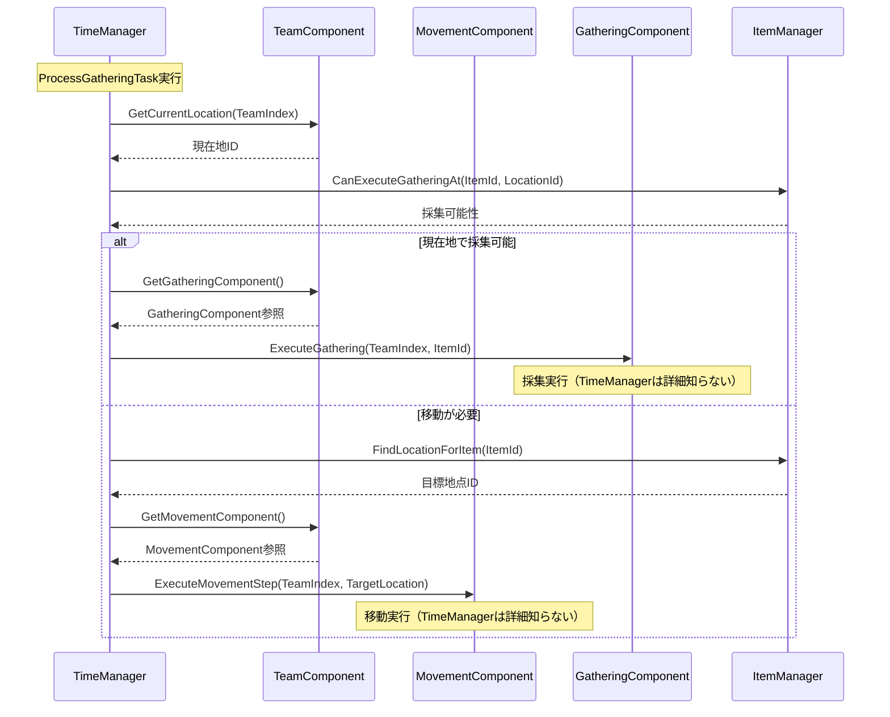
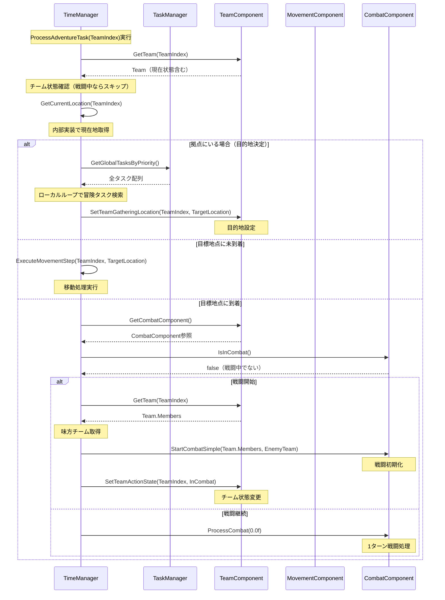
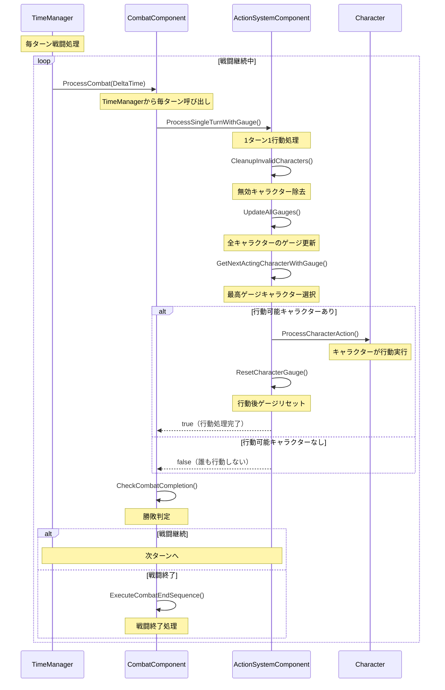
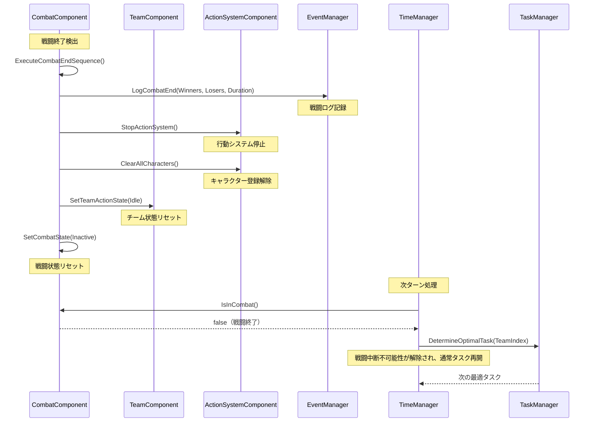
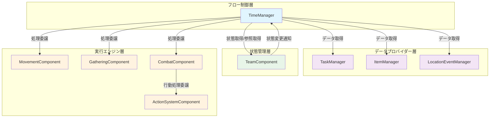
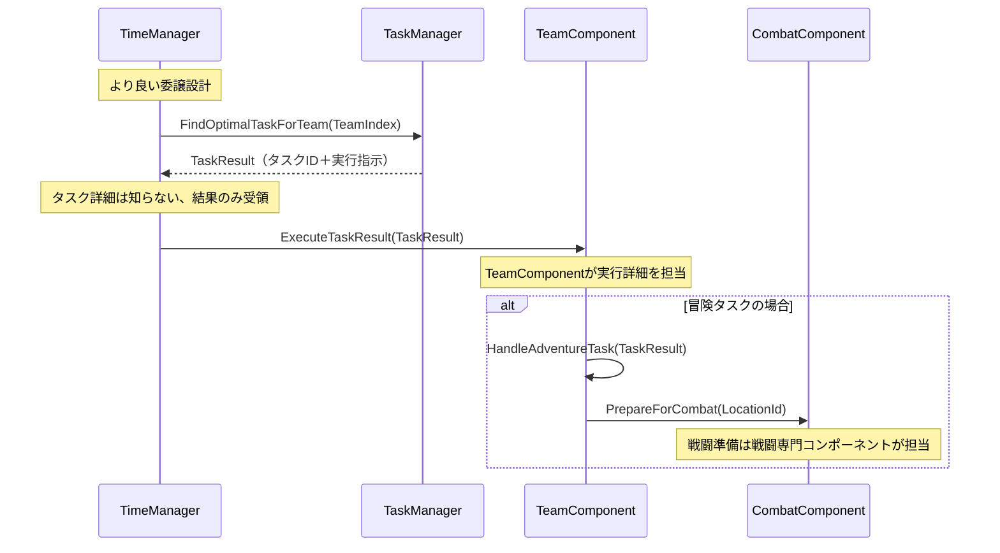

# タスクフロー図

## 概要

TimeManagerとTaskManagerを中心とした「投げ下ろし設計」のフロー図です。各コンポーネントが明確な責任を持ち、上位→下位への一方向依存を維持しています。

## 1. 基本タスク割り当てフロー（実装ベース）

## 2. 採集タスク詳細フロー

## 3. 冒険タスク→戦闘フロー（実装ベース）

## 4. 戦闘中処理フロー（行動ゲージシステム）

## 5. 戦闘終了→タスク再開フロー

## 6. 委譲型設計の責任境界

## 現在の設計問題と改善提案

### ❌ 現在の問題点

1. **責任の混在**: TimeManagerがタスクの詳細構造を知っている
2. **重複実装**: TaskManagerとTimeManagerで同様のロジック
3. **直接的状態変更**: TimeManagerから下位への状態変更指示

### ✅ 推奨される改善設計

### 理想的な責任分担

1. **TimeManager**: タスク結果の受領と実行委譲のみ
2. **TaskManager**: 全タスクロジック（場所選択含む）を担当
3. **TeamComponent**: チーム状態管理と実行調整
4. **CombatComponent**: 戦闘専門処理

### データ駆動設計の実現
- TimeManagerは`TaskResult`構造体のみ処理
- タスク種別の詳細判定はTaskManagerに完全委譲
- 各コンポーネントが自分の専門領域のみ担当