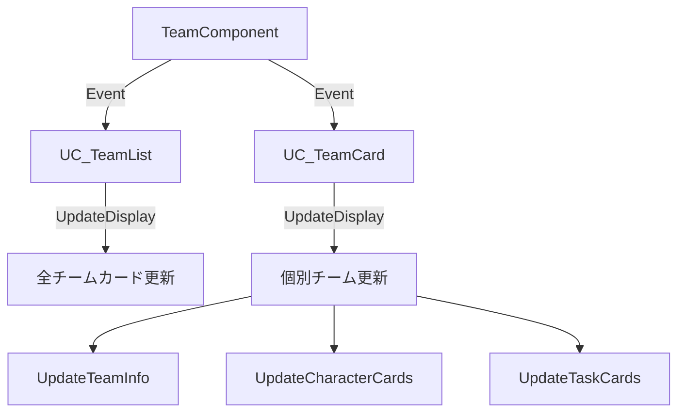

# チーム仕様書 - TeamComponent

## 概要

**TeamComponent** は、UE_Idleプロジェクトにおけるチーム編成と管理を統合的に制御するコンポーネントです。キャラクターの組織化、タスクの割り当て、戦闘システムとの連携、チーム専用インベントリの管理など、複数のシステムを統合した包括的なチーム管理機能を提供します。

## アーキテクチャ

### クラス構造
- **基底クラス**: `UActorComponent`
- **主要ファイル**: `Source/UE_Idle/Components/TeamComponent.h/cpp`
- **依存関係**: `TeamTypes.h`, `TaskTypes.h`, `ItemTypes.h`
- **関連コンポーネント**: `InventoryComponent`, `TaskManagerComponent`, `TimeManagerComponent`

### データ構造

#### 1. FTeam 構造体 (TeamTypes.h:70-311)
チームの基本情報とステータスを管理

```cpp
struct FTeam {
    // メンバー管理
    TArray<AC_IdleCharacter*> Members;          // チームメンバー
    FString TeamName;                           // チーム名
    bool bIsActive;                             // アクティブ状態

    // タスク関連
    ETaskType AssignedTask;                     // 割り当てられたタスク
    FString AdventureLocationId;                // 冒険先ID
    
    // 戦闘関連
    bool bInCombat;                             // 戦闘中フラグ (後方互換性)
    ETeamActionState ActionState;               // 詳細なアクション状態
    ETeamCombatState CombatState;               // 戦闘状態
    
    // 時間管理
    float ActionStartTime;                      // アクション開始時刻
    float EstimatedCompletionTime;              // 推定完了時間
    
    // 運搬システム
    ECarrierType CarrierType;                   // 運搬手段
    float BaseCarryingCapacity;                 // 基本積載量
    
    // 安全性確保
    bool bProcessingAction;                     // 処理中フラグ
}
```

#### 2. FTeamTask 構造体 (TaskTypes.h:162-237)
チーム固有のタスク管理

```cpp
struct FTeamTask {
    int32 Priority;                             // 優先度 (1-3)
    ETaskType TaskType;                         // タスクタイプ
    TMap<FString, int32> RequiredResources;     // 必要リソース
    TMap<FString, int32> RequiredItems;         // 必要アイテム
    int32 MinTeamSize;                          // 最小人数
    float EstimatedCompletionTime;              // 推定完了時間
    bool bIsActive;                             // 実行中フラグ
    float StartTime;                            // 開始時刻
}
```

#### 3. 列挙型定義

**ETaskType** (TeamTypes.h:33-55)
```cpp
enum class ETaskType {
    Idle,          // 待機
    All,           // 全体タスク優先度順実行
    Adventure,     // 冒険
    Cooking,       // 料理
    Construction,  // 建築
    Gathering,     // 採集
    Crafting,      // 製作
    // ... その他拡張可能
}
```

**ETeamActionState** (TeamTypes.h:13-19)
```cpp
enum class ETeamActionState {
    Idle,          // 待機
    Working,       // 作業中 (中断可能)
    InCombat,      // 戦闘中 (中断不可)
    Locked         // アクション中 (中断不可)
}
```

**ECarrierType** (TeamTypes.h:58-64)
```cpp
enum class ECarrierType {
    Bag,           // 袋 (20kg * メンバー数)
    HandCart,      // 手押し車 (50kg * メンバー数)
    Wagon          // 荷車 (100kg * メンバー数)
}
```

## 主要機能

### 1. チーム管理機能

#### チーム作成・削除
```cpp
// TeamComponent.cpp:90-114
int32 CreateTeam(const FString& TeamName)
bool DeleteTeam(int32 TeamIndex)
```

**実装詳細:**
- チーム作成時に自動的にInventoryComponentを動的生成
- タスクリストの初期化
- イベント通知システムの実行

#### メンバー管理
```cpp
// TeamComponent.cpp:151-190
bool AssignCharacterToTeam(AC_IdleCharacter* Character, int32 TeamIndex)
bool RemoveCharacterFromTeam(AC_IdleCharacter* Character, int32 TeamIndex)
```

**特徴:**
- 重複所属の自動解除
- リアルタイム UI更新
- データ整合性チェック

### 2. タスク管理システム

#### 基本タスク割り当て
```cpp
// TeamComponent.cpp:218-238
bool SetTeamTask(int32 TeamIndex, ETaskType NewTask)
bool SetTeamAdventureLocation(int32 TeamIndex, const FString& LocationId)
```

#### 高度なチーム別タスク管理
```cpp
// TeamComponent.cpp:611-770
bool AddTeamTask(int32 TeamIndex, const FTeamTask& NewTask)
bool RemoveTeamTask(int32 TeamIndex, int32 TaskPriority)
bool SwitchToNextAvailableTask(int32 TeamIndex)
```

**チームタスクの特徴:**
- 最大3つのタスクを優先度順で管理
- 実行条件の自動チェック
- 安全なタスク切り替え機能

### 3. 戦闘システム連携

#### 戦闘開始・終了処理
```cpp
// TeamComponent.cpp:913-973
bool StartAdventure(int32 TeamIndex, const FString& LocationId)
void StartCombat(int32 TeamIndex, float EstimatedDuration)
void EndCombat(int32 TeamIndex)
```

**安全性機能:**
- 重複処理防止フラグ
- 非同期タイマーベース処理
- BattleSystemManagerとの連携

### 4. インベントリ統合

#### チーム専用インベントリ
```cpp
// TeamComponent.cpp:517-547
UInventoryComponent* GetTeamInventoryComponent(int32 TeamIndex)
void CreateTeamInventoryComponent(int32 TeamIndex)
```

**運搬システム:**
```cpp
// TeamComponent.cpp:577-607
float GetTeamTotalCarryingCapacity(int32 TeamIndex)
float GetTeamCurrentWeight(int32 TeamIndex)
float GetTeamLoadRatio(int32 TeamIndex)
```

### 5. 状態管理システム

#### アクション状態制御
```cpp
// TeamComponent.cpp:819-883
void SetTeamActionState(int32 TeamIndex, ETeamActionState NewState)
bool CanInterruptAction(int32 TeamIndex)
float GetRemainingActionTime(int32 TeamIndex)
```

## イベントシステム

### 主要デリゲート

#### チーム管理イベント
```cpp
FOnTeamCreated OnTeamCreated;                    // チーム作成時
FOnTeamDeleted OnTeamDeleted;                    // チーム削除時
FOnMemberAssigned OnMemberAssigned;              // メンバー追加時
FOnTaskChanged OnTaskChanged;                    // タスク変更時
FOnTeamsUpdated OnTeamsUpdated;                  // 汎用更新通知
```

#### タスク管理イベント
```cpp
FOnTeamTaskStarted OnTeamTaskStarted;            // タスク開始時
FOnTeamTaskCompleted OnTeamTaskCompleted;        // タスク完了時
FOnTeamTaskSwitched OnTeamTaskSwitched;          // タスク切り替え時
FOnTeamActionStateChanged OnTeamActionStateChanged; // 状態変更時
```

#### 戦闘関連イベント
```cpp
FOnCombatEnded OnCombatEnded;                    // 戦闘終了時
```

## データアクセスパターン

### 読み取り専用アクセス
```cpp
// 安全なデータ取得
TArray<AC_IdleCharacter*> GetUnassignedCharacters() const;
FTeam GetTeam(int32 TeamIndex) const;
ETeamActionState GetTeamActionState(int32 TeamIndex) const;
```

### 状態変更操作
```cpp
// 状態変更は専用メソッドを通して実行
bool SetTeamTask(int32 TeamIndex, ETaskType NewTask);
void SetTeamActionState(int32 TeamIndex, ETeamActionState NewState);
```

## 安全性設計

### 防御的プログラミング

#### 範囲チェック
```cpp
bool IsValidTeamIndex(int32 TeamIndex) const {
    return Teams.IsValidIndex(TeamIndex) && IsValid(this);
}
```

#### 重複処理防止
```cpp
bool bCombatEndProcessing = false;    // 戦闘終了処理中フラグ
bool bTaskSwitchProcessing = false;   // タスク切り替え処理中フラグ
```

#### オブジェクト有効性チェック
```cpp
if (!IsValid(this)) {
    UE_LOG(LogTemp, Error, TEXT("Invalid TeamComponent"));
    return false;
}
```

### 非同期処理対応
```cpp
// 安全な遅延実行
GetWorld()->GetTimerManager().SetTimerForNextTick([this, TeamIndex]() {
    if (IsValid(this) && IsValidTeamIndex(TeamIndex)) {
        // 安全な処理実行
    }
});
```

## パフォーマンス考慮

### 効率的なデータ構造
- **TArray**: シーケンシャルアクセス最適化
- **TMap**: キー値ペアの高速検索
- **Event Dispatcher**: 疎結合な通知システム

### メモリ管理
- **動的生成**: チーム作成時のInventoryComponent生成
- **自動解放**: BeginDestroy()での安全なクリーンアップ
- **循環参照回避**: WeakPtrパターンの採用

## Blueprint連携

### カテゴリ分類
```cpp
UFUNCTION(BlueprintCallable, Category = "Team Management")
UFUNCTION(BlueprintCallable, Category = "Team Task")
UFUNCTION(BlueprintCallable, Category = "Team State")
UFUNCTION(BlueprintCallable, Category = "Combat")
UFUNCTION(BlueprintCallable, Category = "Team Inventory")
```

### UI統合関数
```cpp
// UI Widget初期化用便利関数
FTeam CreateTeamAndGetData(const FString& TeamName, int32& OutTeamIndex);
TArray<FString> GetAllTaskTypeNames();  // 静的ヘルパー関数
```

## 他システムとの連携

### BattleSystemManager
- 戦闘イベントのトリガー
- 戦闘結果の受信と処理

### TaskManagerComponent
- 全体タスクとチームタスクの調整
- リソース可用性チェック

### TimeManagerComponent
- 時間ベースのタスク進行
- オフライン進行計算

### InventoryComponent
- チーム専用ストレージ
- 運搬能力の計算

## 拡張ポイント

### 新タスクタイプの追加
1. `ETaskType`への列挙値追加
2. `GetTaskTypeDisplayName()`の更新
3. 実行ロジックの実装

### カスタムタスク条件
```cpp
// FTeamTaskの拡張例
TMap<FString, int32> RequiredResources;  // リソース条件
TMap<FString, int32> RequiredItems;      // アイテム条件
```

### 高度な戦闘状態管理
```cpp
// ETeamCombatStateによる詳細な状態制御
enum class ETeamCombatState {
    NotInCombat, Starting, InProgress, Ending, Finished
}
```

## デバッグ機能

### ログ出力
```cpp
UE_LOG(LogTemp, Log, TEXT("Team %d started executing task with priority %d"), 
       TeamIndex, Task.Priority);
```

### 状態可視化
```cpp
FString GetActionStateDisplayName() const;
FString GetCombatStateDisplayName() const;
```

## 使用例

### 基本的なチーム作成と管理
```cpp
// 1. チーム作成
int32 TeamIndex = CreateTeam(TEXT("探索隊"));

// 2. メンバー追加
AssignCharacterToTeam(Character1, TeamIndex);
AssignCharacterToTeam(Character2, TeamIndex);

// 3. タスク設定
SetTeamTask(TeamIndex, ETaskType::Adventure);
SetTeamAdventureLocation(TeamIndex, TEXT("森林地帯"));

// 4. 冒険開始
StartAdventure(TeamIndex, TEXT("森林地帯"));
```

### 高度なタスク管理
```cpp
// チーム専用タスクの設定
FTeamTask NewTask;
NewTask.Priority = 1;
NewTask.TaskType = ETaskType::Gathering;
NewTask.MinTeamSize = 2;
NewTask.EstimatedCompletionTime = 3.0f;
NewTask.RequiredItems.Add(TEXT("axe"), 1);

AddTeamTask(TeamIndex, NewTask);
```

## UI システム

### UIアーキテクチャ

TeamComponentは、専用のUIウィジェットシステムと密接に連携し、リアルタイムでチーム情報を表示・操作する機能を提供します。

#### 1. UC_TeamList ウィジェット (C_TeamList.h:18-118)

**役割**: 全チーム一覧の表示とチーム作成機能を提供する親ウィジェット

```cpp
class UC_TeamList : public UUserWidget {
    // ウィジェット構成
    UWrapBox* TeamsWrapBox;              // チームカード配置コンテナ
    UButton* CreateTeamButton;           // チーム作成ボタン
    TArray<UC_TeamCard*> TeamCards;      // 子チームカード管理
    
    // TeamComponent連携
    UTeamComponent* TeamComponent;       // TeamComponent参照
    TSubclassOf<UC_TeamCard> TeamCardClass; // チームカードクラス
}
```

**主要機能:**
- **WrapBox レイアウト**: 画面サイズに応じたチームカードの自動配置
- **動的チーム作成**: ボタンクリックからBlueprintダイアログまでの統合フロー
- **リアルタイム更新**: TeamComponentイベントの自動受信と表示更新

#### 2. UC_TeamCard ウィジェット (C_TeamCard.h:22-151)

**役割**: 個別チームの詳細情報表示と操作インターフェース

```cpp
class UC_TeamCard : public UUserWidget {
    // 表示ウィジェット
    UTextBlock* TeamNameText;            // チーム名表示
    UTextBlock* CurrentTaskText;         // 現在タスク表示
    UTextBlock* TeamStatusText;          // チーム状態表示
    UTextBlock* MemberCountText;         // メンバー数表示
    
    // コンテナウィジェット
    UWrapBox* CharacterCardsContainer;   // キャラクターカード配置
    UVerticalBox* TeamTaskCardsContainer; // チームタスクカード配置
    
    // 子ウィジェット管理
    TArray<UC_CharacterCard*> CharacterCards;  // キャラクターカード
    TArray<UC_TeamTaskCard*> TeamTaskCards;    // タスクカード
}
```

### Event-Driven UI更新システム

#### イベントバインディング構造

**UC_TeamList のイベント処理:**
```cpp
// TeamComponent イベントのバインディング
void OnTeamCreated(int32 TeamIndex, const FString& TeamName);      // 新チーム作成時
void OnTeamDeleted(int32 TeamIndex);                               // チーム削除時
void OnTeamsUpdated();                                             // 汎用更新時
void OnMemberAssigned(int32 TeamIndex, AC_IdleCharacter* Character, const FString& TeamName);
void OnTaskChanged(int32 TeamIndex, ETaskType NewTask);
```

**UC_TeamCard のイベント処理:**
```cpp
// より詳細なチーム固有イベント
void OnMemberAssigned(int32 TeamIndex, AC_IdleCharacter* Character, const FString& TeamName);
void OnMemberRemoved(int32 TeamIndex, AC_IdleCharacter* Character);
void OnTaskChanged(int32 TeamIndex, ETaskType NewTask);
void OnTeamNameChanged(int32 TeamIndex, const FString& NewName);
void OnTeamActionStateChanged(int32 TeamIndex, ETeamActionState NewState);
void OnTeamTaskStarted(int32 TeamIndex, const FTeamTask& StartedTask);
void OnTeamTaskCompleted(int32 TeamIndex, const FTeamTask& CompletedTask);
void OnCharacterDataChanged(AC_IdleCharacter* Character);
```

#### 自動UI更新フロー



### UI構成要素の詳細

#### 1. チームカード表示項目

**基本情報表示:**
- **チーム名**: 編集可能なテキスト表示
- **現在タスク**: アクティブタスクのリアルタイム表示
- **チーム状態**: 待機/作業中/戦闘中/ロック状態
- **メンバー数**: "3/6" 形式での人数表示

#### 2. キャラクターカード統合

```cpp
// キャラクターカードの動的生成と管理
UC_CharacterCard* CreateCharacterCard(AC_IdleCharacter* Character);
void UpdateCharacterCards();  // メンバー変更時の自動更新
void ClearCharacterCards();   // クリーンアップ処理
```

#### 3. チームタスクカード表示

```cpp
// チーム固有タスクの視覚的表示
UC_TeamTaskCard* CreateTaskCard(const FTeamTask& TaskData, int32 TaskPriority);
void UpdateTaskCards();       // タスク変更時の自動更新
```

### Blueprint連携インターフェース

#### チーム作成フロー

```cpp
// C++側での基本処理
void OnCreateTeamClicked();                    // ボタンクリック処理
void ShowTeamNameInputDialog();               // Blueprint実装ダイアログ
void ConfirmCreateTeam(const FString& TeamName); // C++側での確認処理
```

**統合フロー:**
1. **ユーザー操作**: CreateTeamButton クリック
2. **C++処理**: OnCreateTeamClicked() 実行
3. **Blueprint呼び出し**: ShowTeamNameInputDialog() 実行
4. **ユーザー入力**: Blueprint側でテキスト入力
5. **C++復帰**: ConfirmCreateTeam() でチーム作成確定
6. **自動更新**: TeamComponent イベント → UI自動更新

#### 表示更新API

```cpp
// 段階的更新システム
void UpdateDisplay();          // 全体更新
void UpdateTeamInfo();         // 基本情報のみ
void UpdateCharacterCards();   // メンバー表示のみ
void UpdateTaskCards();        // タスク表示のみ
```

### UI性能最適化

#### 効率的な更新戦略

**イベント駆動更新:**
- 変更された項目のみを選択的更新
- 不要なUI再描画の回避
- メモリ効率的なウィジェット管理

**ウィジェット再利用:**
```cpp
// キャッシュされたウィジェットの再利用
TArray<UC_CharacterCard*> CharacterCards;  // プールされたカード
void ClearCharacterCards();                // 安全なクリーンアップ
```

#### レスポンシブデザイン

**WrapBox活用:**
- 画面サイズに応じた自動レイアウト
- モバイル端末での最適表示
- 動的チーム数への対応

### UIデバッグ機能

#### 表示状態の検証

```cpp
// UI状態の確認機能
bool IsValidTeamCard() const;              // カードの有効性チェック
FTeam GetTeamData() const;                 // 現在表示データの取得
int32 GetTeamIndex() const;                // チームインデックス取得
```

#### ログ出力統合

```cpp
// UI更新時のデバッグログ
FString GetCurrentTaskDisplayText() const;  // 表示テキストの確認
FString GetTeamStatusDisplayText() const;   // 状態表示の確認
```

### モバイル最適化

#### タッチインターフェース対応

**大きなタップターゲット:**
- チームカードサイズの最適化
- ボタン配置の指操作対応
- スクロール可能なリスト表示

**パフォーマンス配慮:**
- 必要最小限のUI更新
- 軽量なウィジェット構成
- メモリ使用量の最適化

## まとめ

TeamComponentは、UE_Idleプロジェクトにおけるチーム管理の中核システムです。安全性、拡張性、パフォーマンスを重視した設計により、複雑なチーム編成とタスク管理を効率的に実現しています。Event-drivenなアーキテクチャにより他システムとの疎結合を保ち、Blueprint統合により直感的な操作性を提供します。

UI系統では、UC_TeamListとUC_TeamCardの2階層ウィジェット構造により、スケーラブルで保守性の高いチーム管理インターフェースを実現しています。リアルタイムイベント連携と効率的な更新システムにより、ユーザーに即座にフィードバックを提供し、モバイルプラットフォームでの快適な操作体験を保証します。